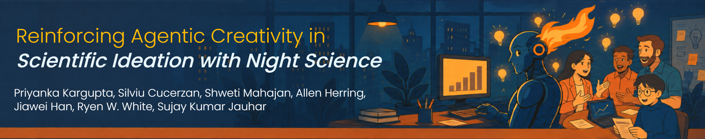
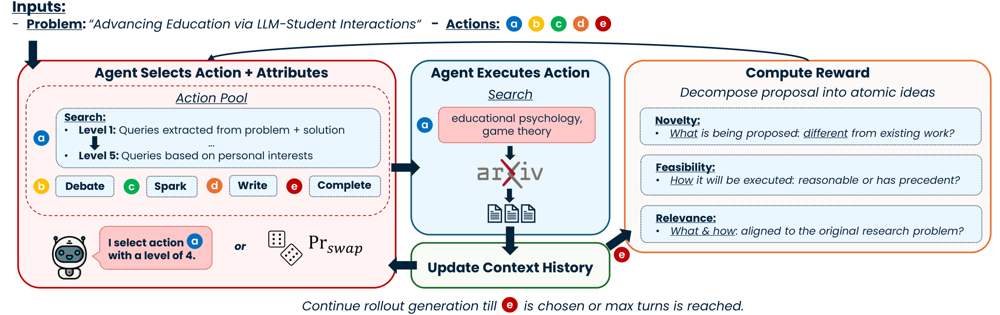

<div align="center">

<p align="center"></p>

</div>

# Reinforcing Agentic Creativity in Scientific Ideation with Night Science

## Links

- [Overview](#overview)
  - [Installation](#installation)
- [The Night Science Loop](#the-night-science-loop)
  - [Action Pool](#action-pool)
  - [Exploration via Pr_swap](#exploration-via-pr_swap)
  - [Reward](#reward)
- [Building the Dataset](#building-the-dataset)
  - [Output Data Format](#output-data-format)
- [The arXiv Retrieval Service](#the-arxiv-retrieval-service)
- [Training](#training)
- [Synthetic Proposal Generation](#synthetic-proposal-generation)

## Overview

Large language models excel at structured, verifiable tasks, but their low-entropy bias
produces homogeneous, predictable outputs that limit open-ended scientific ideation. Real
discovery also needs the loosely structured, serendipitous *night science* that reaches
beyond the ideas typically considered. **AI Night-Scientist** fine-tunes Qwen3-8B-Base with
GRPO so that it can learn *when* and *how* to move beyond predictable reasoning. The agent
represents creativity along three cognitive axes: **action** (what to do next, and how
creatively), **process** (when to explore versus exploit), and **outcome** (whether the final
idea is original, feasible, and relevant). The main model learns these behaviors from an
outcome-level reward on the completed proposal. Compared with zero-shot Qwen3-8B, Night-8B
broadens normalized research-paradigm coverage by **27.8%** and contribution-type coverage
by **14.9%**, while reaching a **56.3% originality win rate** against reconstructed reference
proposals. Simply raising the decoding temperature does not reproduce these gains.



This repository contains **only the code we wrote**. It carries no copy of
[verl](https://github.com/volcengine/verl), the RL framework we build on; `setup.sh` fetches
verl at a pinned commit and grafts our code onto it.

### Installation

```bash
./setup.sh                      # -> ./build/night_ai_scientist
./setup.sh --dest ~/work/dns    # or anywhere you like
```

This clones verl at the commit in `VERL_COMMIT`, applies our 11 patches, and copies
`overlay/` on top. Re-run with `--force` to rebuild.

Everything below runs from the **build directory**, not from this repository:

```bash
cd build/night_ai_scientist
pip install -e .
pip install -r requirements-cuda.txt
```

> `build/` is disposable. Never edit files there; they are overwritten on the next
> `setup.sh --force`. Edit `overlay/` and rebuild.

### Configuration

Deployment-specific values (judge endpoints, credentials, output paths) come from the
environment:

```bash
cp .env.example .env       # then edit
set -a; . ./.env; set +a   # load into your shell
```

The variables you must set to train:

| Variable | Purpose |
|---|---|
| `CREATIVE_AZURE_ENDPOINTS` | Azure OpenAI endpoint(s) for the reward judge. Comma-separate several to spread load; requests are round-robined. |
| `CREATIVE_AZURE_MODELS` | Deployment name(s), e.g. `gpt-4.1`. |
| `CREATIVE_RETRIEVER_URL` | Where the `search` action sends queries. Defaults to `http://127.0.0.1:8000/retrieve`. |
| `OUTPUTS` | Root for checkpoints and logs. |

Authenticate to Azure in one of three ways: managed identity / `az login` (the default,
set nothing), `CREATIVE_AZURE_API_KEYS` inline, or `CREATIVE_AZURE_API_KEY_ENV_VARS`
naming other variables that hold the keys. `.env.example` covers the rest: Ray address,
Weights & Biases, Hugging Face, Kaggle, and the synthetic-generation settings.

## The Night Science Loop

Each training example is one **rollout**. The model selects an action, executes it, adds the
result to its working context, and repeats until it chooses `complete` or reaches the turn
limit. The main recipe then scores the completed proposal with the outcome-level reward.

The agent loop is implemented in
`overlay/verl/experimental/agent_loop/creative_tool_agent_loop.py` and registered as
`creative_tool_agent`. `overlay/verl/interactions/proposal_gen_interaction.py` executes
the selected actions and maintains the proposal context between turns.

### Action Pool

Five actions. Three of them take a **noise level** from 1 to 5, which the model also chooses:

| Action | Noise | What it does |
|---|---|---|
| `search` | 1–5 | Generates semantic queries and retrieves arXiv papers. Level 1 is extracted directly from the problem and current draft; level 5 is driven by tangential personal interest. |
| `debate` | 1–5 | Stages a conversation with generated personas. Level 1 is a senior researcher in the same subfield; level 5 mixes experts from unrelated disciplines arguing at the level of philosophy. |
| `spark` | 1–5 | Produces a "bit-flip": an assumption to overturn. Level 1 challenges a local detail; level 5 attacks the paradigm the proposal rests on. |
| `write` | n/a | Writes or revises the proposal. |
| `complete` | n/a | Declares the process finished, ending the rollout. |

Every prompt and output schema for these lives in one file:
`overlay/verl/interactions/utils/proposal_gen_utils.py`. It is the best place to start reading.

### Exploration via Pr_swap

Early in training the model has no idea what the actions are worth, and left alone it
collapses onto `write, complete` almost immediately. So we override it: with probability
`swap_action` the selected action is discarded and a random one substituted, with
`swap_action_decay` shrinking that probability each step.

```yaml
multi_turn:
  swap_action: 0.5          # start by overriding half of all choices
  swap_action_decay: 0.001  # hand control back to the policy over training
```

### Reward

The main Qwen3-8B recipe uses `compute_outcome_score`. It breaks each proposal phase into
what the phase proposes and how it will be carried out, then evaluates three qualities:

- **Precedence**: does the core idea move beyond the closest retrieved work?
- **Feasibility**: is the execution plan credible, specific, and grounded in methodological
  precedent?
- **Relevance**: does the idea directly address the original research problem?

Precedence and relevance are averaged across the proposal's phases. Feasibility uses the
lowest-scoring execution plan, since one infeasible phase can undermine the whole proposal.
The three proposal-level scores are normalized to `[-1, 1]` and averaged to produce the
outcome reward.

To include direct feedback on the reasoning trajectory as well, change
`compute_outcome_score` to `compute_process_outcome_score` in the training config.

| File | Role |
|---|---|
| `overlay/verl/utils/reward_score/proposal_gen_new_rewards.py` | Outcome and optional process reward computation; `compute_outcome_score` is the default entry point. |
| `overlay/verl/workers/reward_manager/creative.py` | Registered as `creative`; pulls action histories out of each rollout. |
| `overlay/verl/workers/reward_manager/creative_api.py` | Batched Azure OpenAI judge client, fanning out across several endpoints. |
| `overlay/verl/experimental/reward_loop/reward_manager/creative.py` | Adapter for verl's newer async reward loop. |

> The judge is not free. Every completed proposal requires several GPT-4.1 calls, and these
> calls dominate the cost of a real training run. Start with a small `train_batch_size` while
> checking that the retrieval and reward services work end to end.

## Building the Dataset

```bash
python examples/data_preprocess/proposal_gen.py
```

Pulls [`davidheineman/nsf-awards`](https://huggingface.co/datasets/davidheineman/nsf-awards),
keeps CSE awards from 2018 on, drops travel, workshop, and conference grants, and writes a
90/10 split.

**Arguments:**
- `--hf_repo_id`: source dataset (default: `davidheineman/nsf-awards`)
- `--local_dir`: output directory (default: `data/day_night/proposal_gen`)
- `--min_year`: earliest award year to keep (default: `2018`)
- `--hdfs_dir`: optional HDFS directory to copy the Parquet files to

### Output Data Format

Each row of `train.parquet` / `test.parquet` carries the problem, the action-selection prompt
the model sees on turn one, and the tool/interaction wiring verl needs:

```
{
    "award_problem": [str: the NSF award title, used as the research problem],
    "data_source": "nsf_awards",
    "prompt": [
        {"role": "system", "content": "[researcher persona + proposal task definition]"},
        {"role": "user",   "content": "[action menu with noise levels 1-5]"}
    ],
    "ability": "research_proposal_writing",
    "reward_model": {"style": "implicit", "ground_truth": null},
    "extra_info": {
        "need_tools_kwargs": true,
        "tools_kwargs":       {"search": {"create_kwargs": {...}}},
        "interaction_kwargs": {...}
    }
}
```

There is no ground-truth proposal: the reward is computed by a judge, not by comparison.

## The arXiv Retrieval Service

The `search` action queries a dense arXiv index served by the companion repository,
[/synthetic_proposals](https://anonymous.4open.science/status/synthetic_proposals-ECF8). `setup.sh`
clones it to `companion/` at the pinned commit and installs the verl-side search client, so
there is nothing extra to wire up.

Build the index, then start the service:

```bash
cd companion
pip install -r requirements.txt
python retrieval/process_arxiv.py --input arxiv-metadata-oai-snapshot.json \
    --output output/arxiv_papers.jsonl
bash retrieval/build_index.sh              # embeds ~2.5M abstracts; wants a multi-GPU node
bash retrieval/arxiv_emb_retrieval.sh      # serve on :8000 and leave running
```

Training reaches it via `CREATIVE_RETRIEVER_URL` (default `http://127.0.0.1:8000/retrieve`);
any service answering `POST /retrieve` with `{"queries": [...], "topk": N}` will do.

> **Start this before training.** A dead retrieval server does not crash the run. `search`
> returns nothing, and the model quietly learns that searching is worthless.

## Training

The reported 8B setting is fully specified in `configs/night_science_8b.yaml`: end-to-end
GRPO fine-tuning of Qwen3-8B-Base on 4 nodes × 8 GPUs, with eight sampled trajectories per
prompt and the outcome-only reward described above. Submit it to Ray:

```bash
set -a; . ./.env; set +a
./launch.sh                              # or: ./launch.sh --config-name my_config
```

The knobs that matter most:

| Config key | Meaning |
|---|---|
| `rollout.agent.default_agent_loop` | Must be `creative_tool_agent`; this is what selects the loop. |
| `rollout.multi_turn.max_assistant_turns` | Turn budget; `2 * num_actions + 1`. |
| `rollout.multi_turn.swap_action` / `_decay` | Forced-exploration rate and its decay. |
| `custom_reward_function.name` | `compute_outcome_score` for the paper's main setting; use `compute_process_outcome_score` to include direct process feedback. |

## Synthetic Proposal Generation

Also in the companion repository: for each NSF award, find the arXiv papers that actually
resulted from it, then have a model write the proposal that would have preceded them,
yielding *grounded* synthetic proposals for use as training data or as a reference point.

```bash
cd companion && bash synthetic/run_synthetic_proposals.sh \
  --input-file ../data/day_night/proposal_gen/test.parquet --max-samples 10
```
